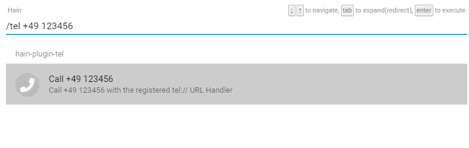

# hain-plugin-tel
A [Hain](https://github.com/appetizermonster/hain) plugin for calling the systems tel:// protocol Handler



## Requirements

To use this plugin you need to have a working tel:// protocol handler registered in your operating system.

## Install

- To install, run this command in the Hain input text area:

```
/hpm install hain-plugin-tel
```
- And then reload the plugins:

```
/hain reload
```

## Usage

```
/tel [number_to_dial]
```

## LICENSE

[MIT License](LICENSE)